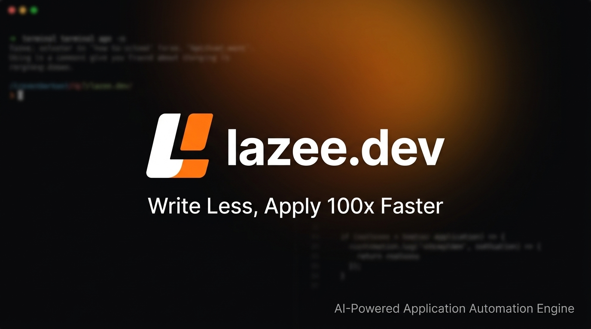
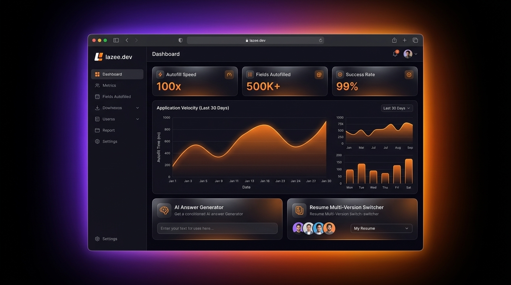
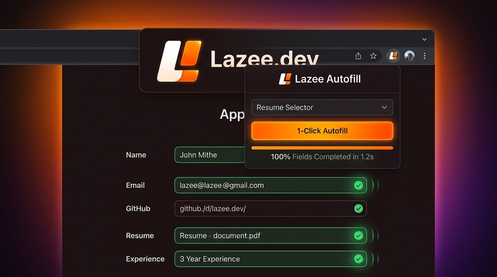
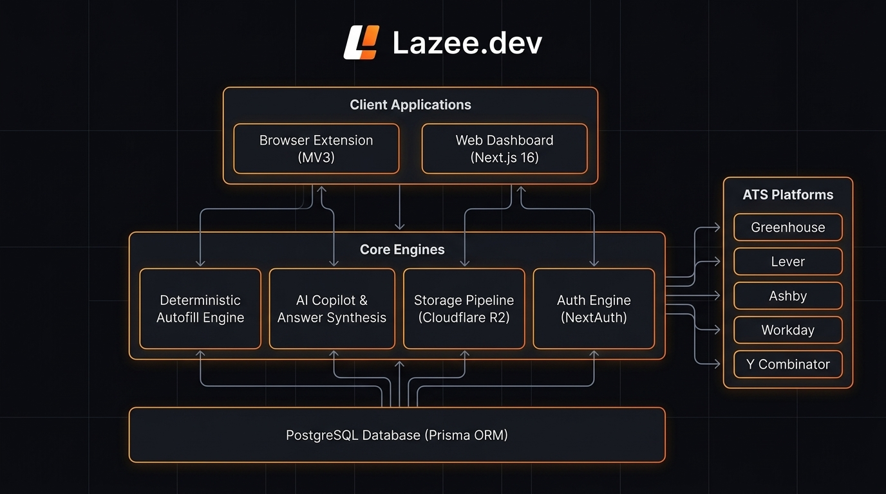

<p align="center">
  <a href="https://lazee.dev"><b>Website</b></a> ·
  <a href="#-quick-start-local-development"><b>Quick Start</b></a> ·
  <a href="./CONTRIBUTING.md"><b>Contributing</b></a> ·
  <a href="#%EF%B8%8F-how-it-works--architecture"><b>Architecture</b></a> ·
  <a href="#-roadmap--current-initiatives"><b>Roadmap</b></a> ·
  <a href="./LICENSE"><b>License</b></a>
</p>

<p align="center">
  
</p>

<p align="center">
  <a href="https://lazee.dev">
    
  </a>
  <a href="https://github.com/Sahill357/lazee.dev.next/stargazers">
    
  </a>
  <a href="./CONTRIBUTING.md">
    
  </a>
  <a href="https://nextjs.org">
    
  </a>
  <a href="https://www.prisma.io">
    
  </a>
  <a href="https://www.docker.com">
    
  </a>
</p>

---

## What is Lazee.dev?

> **Write Less, Apply 100x Faster.**

**Lazee.dev** is an open-source, AI-powered application automation platform and browser extension for software engineers and job seekers. 

Stop re-typing repetitive credentials across hundreds of ATS job portals. Lazee combines a **deterministic autofill engine** with an **intelligent LLM prompt pipeline** to fill applications in seconds, switch tailored resume versions, and craft custom responses with zero copy-pasting.

### Core Features

- ☑️ **Deterministic Form Autofill**: Instant form completion across Greenhouse, Lever, Ashby, Workday, and 100+ ATS platforms.
- ☑️ **AI Answer Assistant**: Synthesizes contextual answers for open-ended questions based on your verified experiences and projects.
- ☑️ **Multi-Version Resume Management**: Switch seamlessly between specialized resume versions directly from the browser popup.
- ☑️ **Public Developer Portfolio**: Showcase your verified background, stack, and top projects at `lazee.dev/u/{username}`.
- ☑️ **Integrated Careers Board**: Built-in candidate management and job listings at `/careers`.
- ☑️ **Zero-Config Local Dev Mode**: 1-Click developer login for contributors without needing Google Cloud OAuth or SMTP credentials.

---

## Product Showcase

<p align="center">
  
</p>

### Autofill in Action

<p align="center">
  
</p>

---

## ⚡ Quick Start (Local Development)

Lazee provides a zero-friction local development setup with Dockerized PostgreSQL and built-in **Local Dev Mode** — no external API credentials needed to get started.

### Prerequisites

- [Node.js](https://nodejs.org/) `v20.x` or higher
- [Docker](https://docs.docker.com/get-docker/) & Docker Compose v2.20+
- Git

### One-Command Setup

```bash
# 1. Clone your fork
git clone https://github.com/Sahill357/lazee.dev.next.git
cd lazee.dev.next

# 2. Install dependencies
npm install

# 3. Run automated contributor setup
npm run setup

# 4. Start Next.js development server
npm run dev
```

Visit [http://localhost:3000](http://localhost:3000) in your browser.

> 💡 **Instant Dev Sign-In**: Navigate to `/login` and click **⚡ 1-Click Dev Sign In**. This logs you into `dev@lazee.dev` with pre-seeded mock developer data, Pro membership, and admin access without any OAuth configuration!

---

## ⚙️ How It Works & Architecture

<p align="center">
  
</p>

The platform is designed with modular, decoupled components:

1. **Client Applications**:
   - **Browser Extension (Manifest V3)**: Injected content scripts detect ATS platforms, match inputs deterministically, and stream real-time fill events.
   - **Web Dashboard (Next.js 16)**: Full-stack App Router with React 19, Server Actions, and Tailwind CSS v4.

2. **Core Engines**:
   - **Deterministic Autofill Engine**: Field classification heuristics map standard inputs (name, contact, education, work history, links) with high precision.
   - **AI Copilot & Answer Synthesis**: LLM prompt pipeline via OpenRouter formats personalized answers to complex company questions.
   - **Storage Pipeline**: Cloudflare R2 / S3-compatible presigned URL uploads for resume PDFs.
   - **Auth Engine**: Auth.js (NextAuth v5) supporting Google OAuth, magic link email, and local development credentials bypass.

3. **Database Foundation**:
   - **PostgreSQL 16**: Managed with Prisma ORM using `@prisma/adapter-pg` with connection pooling and automated schema synchronization.

---

## 🌐 Supported ATS Platforms

| Platform | Autofill Support | AI Custom Answers | Resume Upload |
| :--- | :---: | :---: | :---: |
| **Greenhouse** | ✅ Complete | ✅ Yes | ✅ Direct PDF |
| **Lever** | ✅ Complete | ✅ Yes | ✅ Direct PDF |
| **Ashby** | ✅ Complete | ✅ Yes | ✅ Direct PDF |
| **Workday** | ✅ Complete | ✅ Yes | ✅ Multi-Step |
| **Y Combinator** | ✅ Complete | ✅ Yes | ✅ Profile Sync |
| **SmartRecruiters** | ✅ Complete | ✅ Yes | ✅ Direct PDF |
| **Wellfound** | ✅ Complete | ✅ Yes | ✅ Profile Sync |
| **Google Forms & Tally** | ✅ Complete | ✅ Yes | ✅ Presigned Link |

---

## 💻 Contributor Scripts

| Command | Description |
| :--- | :--- |
| `npm run setup` | Automates `.env.local` creation, Docker container startup, database schema push, and mock data seeding |
| `npm run dev` | Starts the Next.js dev server at `http://localhost:3000` |
| `npm run build` | Compiles the production build and generates the Prisma client |
| `npm run lint` | Runs ESLint validation across the codebase |
| `npm run db:up` | Boots the local PostgreSQL container via Docker Compose |
| `npm run db:down` | Stops the PostgreSQL container |
| `npm run db:push` | Synchronizes Prisma schema changes with PostgreSQL |
| `npm run db:seed` | Seeds mock developer user, experiences, and career postings |
| `npm run db:studio` | Launches Prisma Studio GUI at `http://localhost:5555` |
| `npm run db:reset` | Completely wipes and re-seeds the local database |

---

## 🗺️ Roadmap & Current Initiatives

- [ ] Interactive onboarding checklist for new users
- [ ] Telemetry and event tracking integration
- [ ] Job Description match score analyzer (e.g. 50% match, 90% match)
- [ ] AI resume customizer tailored for specific job posts
- [ ] Manifest V3 multi-browser extension bundle (Chrome, Brave, Edge, Firefox)

---

## 🤝 Contributing

We welcome contributions of all kinds! Please read our [**CONTRIBUTING.md**](./CONTRIBUTING.md) for detailed guidelines on:
- Setting up your local environment
- Git workflow and Conventional Commit standards
- Submitting Pull Requests and review checklists

---

## 📄 License

This repository is licensed under the [MIT License](./LICENSE).
